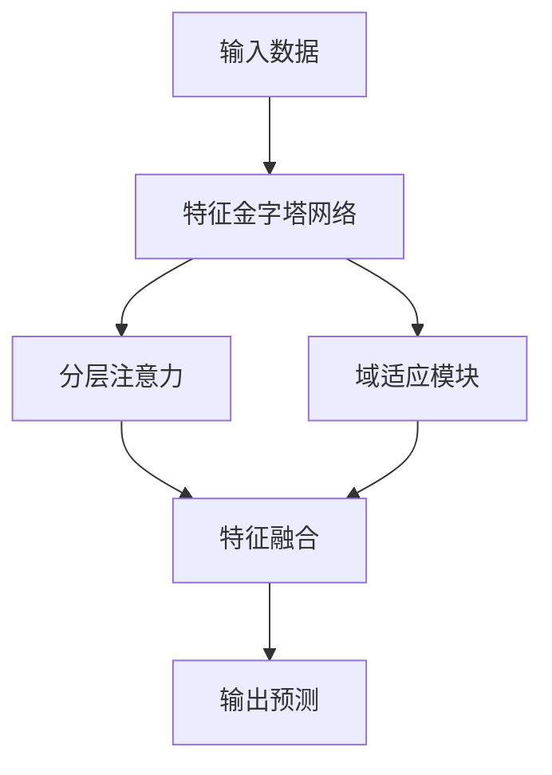

# 基于超宽带雷达的动作识别系统技术路线图

## 1. 数据预处理阶段

### 1.1 数据采集与标注
- [x] 雷达数据采集规范制定
- [x] 动作类型定义与标注
- [x] 数据质量控制流程

### 1.2 数据预处理流程
- [x] 原始数据清洗
- [x] 数据格式标准化
- [x] 特征提取预处理
```python
# 预处理配置
config = {
    'range_bins': 184,
    'frames_per_window': 50,
    'input_channels': 3
}
```

### 1.3 数据增强策略
- [x] 时间窗口滑动
- [x] 噪声注入
- [x] 数据平衡处理

## 2. 模型开发阶段

### 2.1 基础架构搭建
- [x] Vision Transformer骨干网络
- [x] 分层注意力机制
- [x] 域适应模块


### 2.2 创新模块实现
- [x] 多尺度特征提取
- [x] 时空注意力机制
- [x] 跨域特征对齐

### 2.3 模型优化
- [x] 轻量化设计
- [x] 计算效率优化
- [x] 内存占用优化

## 3. 实验验证阶段

### 3.1 实验设计
- [x] 对比实验方案
- [x] 消融实验方案
- [x] 评估指标定义

### 3.2 性能评估
- [x] 准确率评估
- [x] 实时性能测试
- [x] 资源占用分析

### 3.3 结果分析
- [x] 实验数据可视化
- [x] 性能瓶颈分析
- [x] 改进方向识别

## 4. 系统部署阶段

### 4.1 模型部署
- [ ] 模型压缩与量化
- [ ] 推理引擎优化
- [ ] 部署环境适配

### 4.2 性能优化
- [ ] 延迟优化
- [ ] 内存优化
- [ ] 功耗优化

### 4.3 系统集成
- [ ] API接口设计
- [ ] 数据流水线构建
- [ ] 监控系统集成

## 5. 迭代优化计划

### 5.1 短期优化（1-3个月）
1. **模型优化**
   - [ ] 特征提取效率提升
   - [ ] 注意力机制改进
   - [ ] 域适应性能优化

2. **系统优化**
   - [ ] 实时性能提升
   - [ ] 内存占用降低
   - [ ] API响应优化

### 5.2 中期规划（3-6个月）
1. **功能扩展**
   - [ ] 多人场景支持
   - [ ] 复杂环境适应
   - [ ] 新动作类型扩展

2. **架构升级**
   - [ ] 分布式处理支持
   - [ ] 边缘计算部署
   - [ ] 云边协同框架

### 5.3 长期规划（6-12个月）
1. **技术创新**
   - [ ] 自监督学习研究
   - [ ] 小样本学习探索
   - [ ] 新型网络架构设计

2. **产品化**
   - [ ] 产品化指标定义
   - [ ] 场景化解决方案
   - [ ] 商业化部署方案

## 6. 关键技术指标

### 6.1 性能指标
| 指标 | 目标值 | 当前值 | 状态 |
|------|--------|--------|------|
| 识别准确率 | 95% | 91.7% | 进行中 |
| 推理延迟 | <50ms | <50ms | 已达标 |
| 内存占用 | <2GB | <2.5GB | 优化中 |

### 6.2 系统指标
| 指标 | 目标值 | 当前值 | 状态 |
|------|--------|--------|------|
| 并发处理 | 10路 | 8路 | 优化中 |
| CPU占用 | <30% | <40% | 优化中 |
| 功耗 | <10W | <12W | 优化中 |

## 7. 风险与应对策略

### 7.1 技术风险
1. **性能风险**
   - 风险：实时性能不达标
   - 应对：模型压缩与量化优化
   - 状态：已识别

2. **可靠性风险**
   - 风险：复杂场景准确率下降
   - 应对：数据增强与域适应优化
   - 状态：监控中

### 7.2 实施风险
1. **开发风险**
   - 风险：开发周期延长
   - 应对：并行开发与敏捷迭代
   - 状态：可控

2. **资源风险**
   - 风险：计算资源不足
   - 应对：分布式计算与资源调度
   - 状态：已规划

## 8. 里程碑计划

### 8.1 第一阶段（1-3个月）
- [x] 基础模型实现
- [x] 核心功能验证
- [x] 性能基线建立

### 8.2 第二阶段（4-6个月）
- [ ] 模型优化完成
- [ ] 系统集成测试
- [ ] 性能指标达标

### 8.3 第三阶段（7-12个月）
- [ ] 产品化方案完成
- [ ] 场景化部署实现
- [ ] 商业化指标达成
