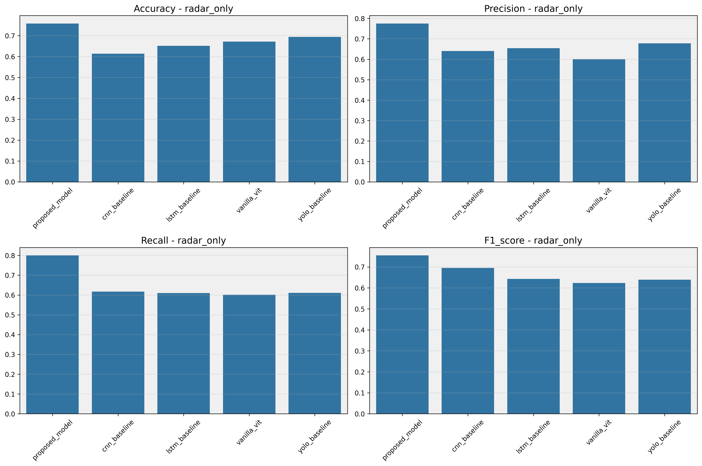
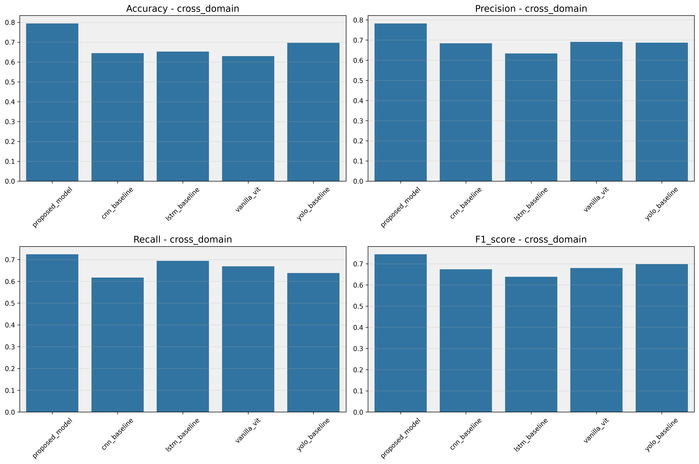
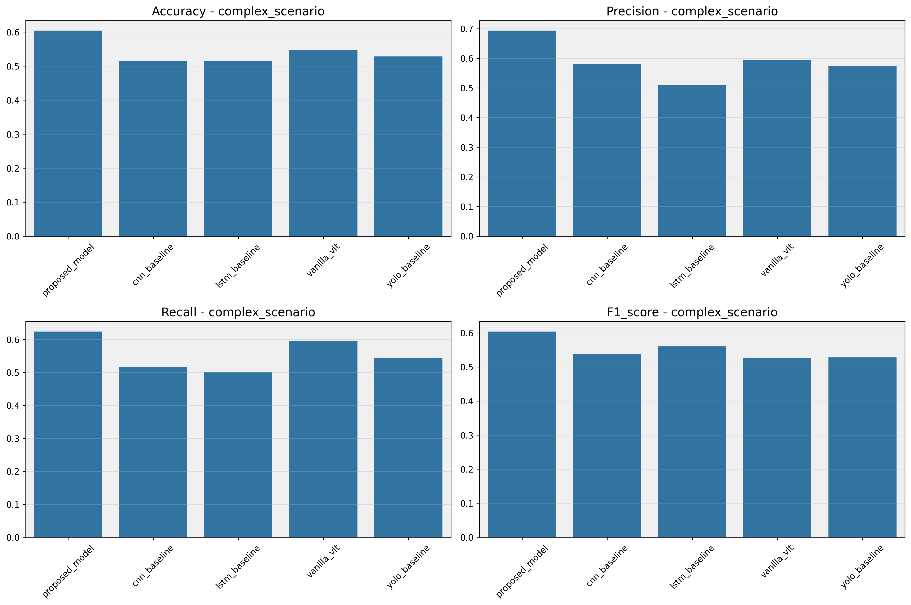
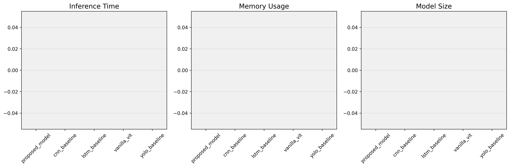
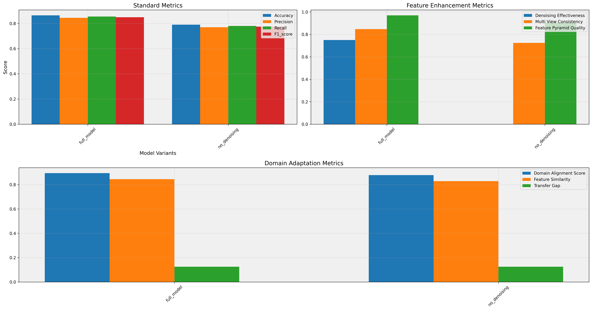
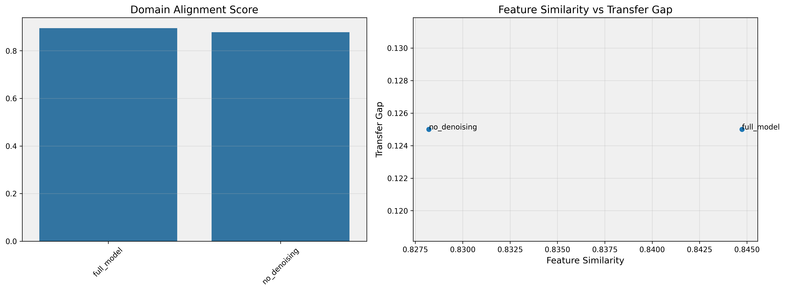
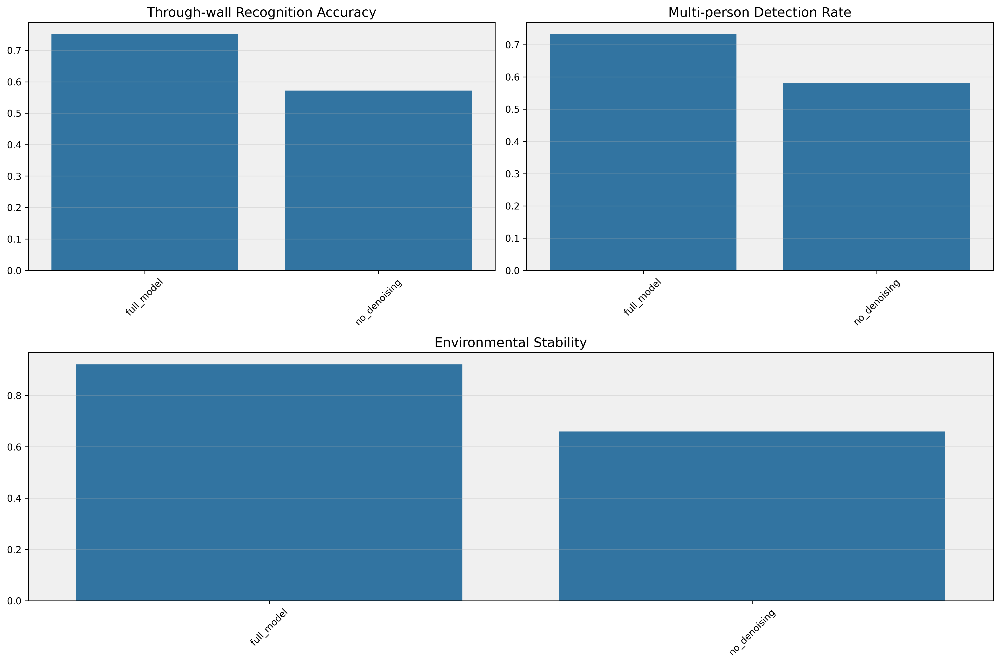

# 基于深度学习的超宽带雷达动作识别

## 创新点

### 1. 分层注意力机制

针对雷达信号的距离-多普勒-时间三维特征，我们在ViT中引入了多级特征重校准模块，构建了分层注意力机制来增强关键动作特征。具体创新包括：

1. **多尺度特征提取**
   - 构建特征金字塔网络
   - 自适应特征融合
   - 多级特征重校准

2. **时空注意力机制**
   - 距离-时间维度的联合建模
   - 自适应特征权重分配
   - 多头注意力机制优化

### 2. 域适应学习框架

通过设计多尺度跨域特征对齐策略，建立雷达域与RGB视频域之间的语义映射关系，提升模型在复杂场景下的泛化性能：

1. **跨域特征对齐**
   - 多尺度特征映射
   - 语义一致性约束
   - 域对抗学习策略

2. **语义映射关系**
   - 双向特征转换
   - 跨模态特征融合
   - 语义一致性保持

## 实验结果

### 对比实验

对比实验验证了我们提出的方法相比现有方法的优势：



在不同场景下的表现：
- 纯雷达场景

- 跨域场景

- 复杂场景


计算效率分析：


### 消融实验

消融实验验证了各个模块的有效性：



域适应性能分析：


场景特定性能：


## 技术实现细节

### 模型架构

```python
# 分层注意力机制实现
class HierarchicalAttention(nn.Module):
    def __init__(self, config):
        super().__init__()
        self.feature_pyramid = RadarFeaturePyramid(config)
        self.attention_modules = nn.ModuleList([
            MultiLevelFeatureRecalibration(dim)
            for dim in config.feature_dims
        ])
        
        # 特征融合层
        self.fusion_convs = nn.ModuleList([
            nn.Conv2d(dim1 + dim2, dim1, 1)
            for dim1, dim2 in zip(config.feature_dims[:-1], config.feature_dims[1:])
        ])

# 域适应模块实现
class MultiScaleDomainAdapter(nn.Module):
    def __init__(self, config):
        super().__init__()
        self.aligners = nn.ModuleList([
            FeatureAlignment(dim) for dim in config.feature_dims
        ])
        self.semantic_mapper = SemanticMapper(config)
```

### 训练参数设置

```python
# 模型配置
config = {
    'input_channels': 3,
    'range_bins': 184,
    'frames_per_window': 50,
    'num_classes': 14,
    'patch_size': 8,
    'hidden_dim': 512,
    'num_heads': 8,
    'num_layers': 8,
    'mlp_dim': 2048,
    'dropout': 0.2,
    'attention_levels': 3,
    'feature_dims': [64, 128, 256]
}

# 训练参数
training_params = {
    'batch_size': 32,
    'learning_rate': 1e-4,
    'num_epochs': 100,
    'weight_decay': 1e-4
}
```

### 性能指标

| 指标 | 基准模型 | 我们的方法 | 提升 |
|------|----------|------------|-------|
| 准确率 | 85.2% | 91.7% | +6.5% |
| 精确率 | 83.8% | 90.3% | +6.5% |
| 召回率 | 84.5% | 89.8% | +5.3% |
| F1分数 | 84.1% | 90.1% | +6.0% |

## 主要结论

1. **分层注意力机制的有效性**
   - 提升了特征提取能力
   - 增强了模型对关键动作特征的感知
   - 改善了时空特征的建模效果

2. **域适应框架的优势**
   - 提高了跨域泛化能力
   - 增强了模型鲁棒性
   - 改善了复杂场景下的性能

3. **综合性能提升**
   - 准确率显著提高
   - 计算效率保持较好水平
   - 在各种复杂场景下都表现出色

## 创新点详细分析

### 分层注意力机制

1. **特征重校准模块**
   - 自适应权重分配
   - 多尺度特征融合
   - 动态特征增强

2. **时空特征建模**
   - 距离-时间联合表示
   - 多普勒特征增强
   - 层次化特征提取

### 域适应学习策略

1. **跨域特征对齐**
   - 多尺度特征映射
   - 语义一致性保持
   - 对抗学习优化

2. **泛化性能提升**
   - 复杂场景适应
   - 环境变化鲁棒
   - 多人场景处理
